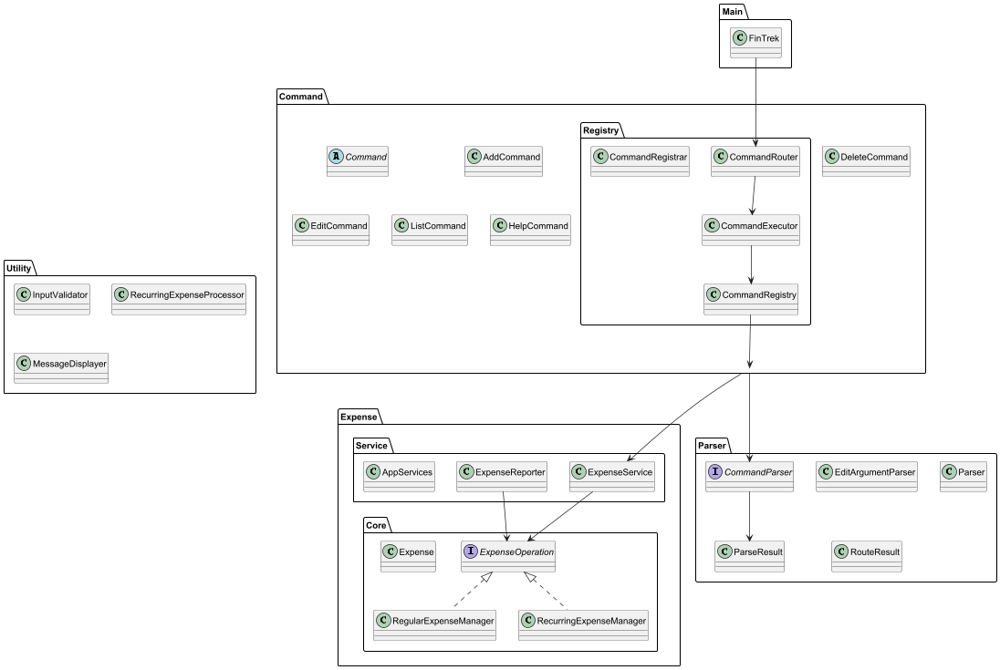
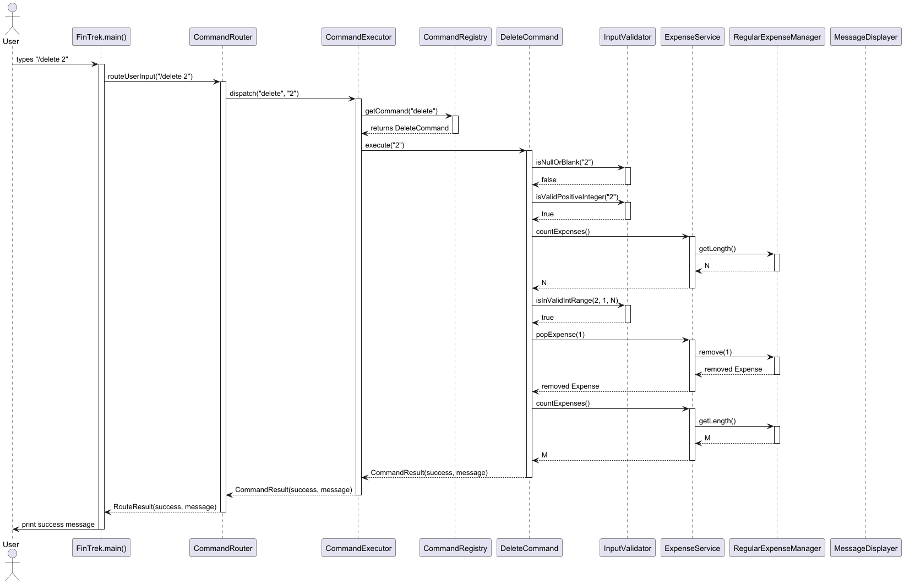
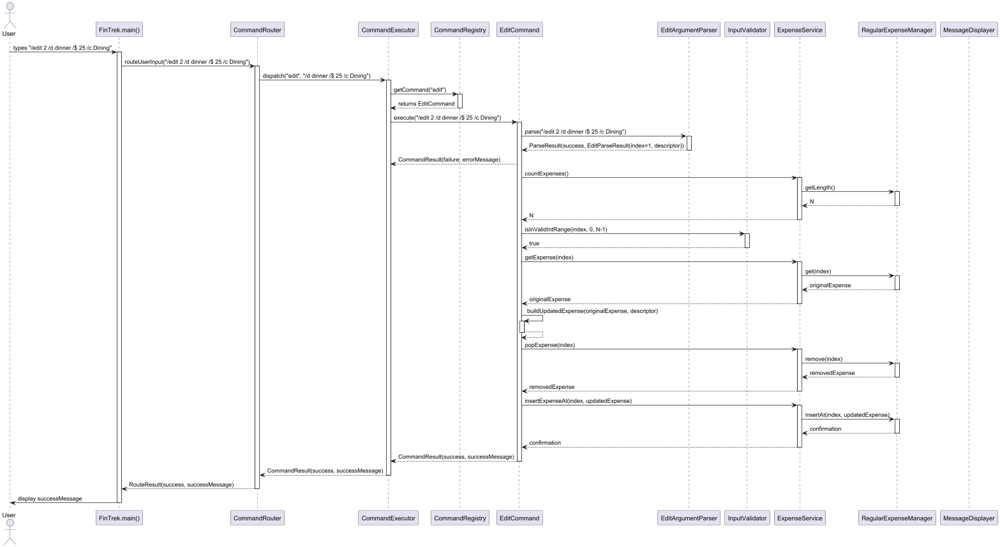

# Developer Guide

## Acknowledgements

{list here sources of all reused/adapted ideas, code, documentation, and third-party libraries -- include links to the original source as well}

## Design & implementation

FinTrek is a desktop app designed for university students to manage their expenses, optimized for use via the Command Line Interface (CLI).

## Architecture Overview

* **Parser**: To verify that user input is correctly interpreted and dispatched to the appropriate command.

* **Command classes**: Each command for the app is separated into specific classes, mainly `AddCommand`, `DeleteCommand`, `EditCommand`, `HelpCommand` and `ListCommand`.

* **General and Recurring Expenses list**: A general list would save all the general expenses created by the user, while recurring expenses list comprise of expenses that will be added at their respective stipulated dates.

* **Storage**: `DataHandler` will hanlde downloading and uploading both general and recurring expenses to `data.txt` file.


## Logging

`Logger.info` was used through out the code to help the process of debugging and ensuring developers what commands or classes are called in the process.

## Input handling

All user inputs will be forced to be lowercase to be compared with the HashMap for the functions created for general and recurring expenses.

## Enhancements

### Adding Expenses


### Delete Expenses

#### Overview
The `/delete` command enables users to remove an expense from the expense list by specifying its index.

#### Sequence Diagram



#### Why It’s Implemented This Way
- Separation of Concerns: Logic for input routing and command execution are cleanly separated.
- Extendability: Easily extensible to support `/delete-recurring`.

### Edit Expenses

#### Sequence Diagram



### Recurring Expenses

#### Current implementation

The recurring expense mechanism comprises several classes `AddRecurringCommand.java`, `DeleteRecurringCommand.java`, 
and `ListRecurringCommand.java` which extends from `Command`. This includes several commands:

* `/recurring` — Adds a new recurring expense into the recurring expenses list (different from the general expenses list)
* `/list-recurring` — Lists out all recurring expenses recorded
* `/delete-recurring`— Delete an existing recurring expense from the list

These recurring expenses will be added monthly once the current date matches the stipulated date of the recurring expense.


#### Design Considerations

* **Alternative 1 (current choice):** Separated functions to add a recurring expense and general expense
  * Pros: Easier to implement with minor adjustment to calling recurringExpenses and not expenses Array list, by setting a boolean variable `isRecurring`.
  * Cons: Need 
* **Alternative 2:** Add a boolean variable 
  * Pros: There is no need for extra commands specific to a recurring expense.
  * Cons: User needs to input another boolean variable when adding an expense to the list.
  The codes related classes such as `AddCommand`, `DeleteCommand` and `ListCommand` will need to be readjusted.

#### Unit Testing

```
@ParameterizedTest
    @ValueSource(strings = {"20", "0.99", "45.67", "1.00", "1.0000"})
    public void testAddRecurringCommand_validAmount_success(String inputAmount) {
        AddRecurringCommand addCommand = new AddRecurringCommand(true);
        String input = "bus $" + inputAmount + " /c transport" + "01-01-2025";
        CommandResult result = addCommand.execute(input);
        int size = ExpenseManager.checkRecurringExpenseSize();
        int index = size - 1;

        TestUtils.assertCommandSuccess(result, input);
        TestUtils.assertCorrectRecurringListSize(size, input);
        TestUtils.assertCorrectRecurringDesc(index, input, "bus");
        TestUtils.assertCorrectRecurringAmount(index, input, Double.parseDouble(inputAmount));
        TestUtils.assertCorrectRecurringCategory(index, input, "TRANSPORT");
    }
```


## Product scope
### Target user profile

University Students

We would like to help students to manage their money wisely through creating a financial chatbot: FinTrek.
Hopefully, students will be more financially conscious and able to manage their budget wisely. 

### Value proposition

1. Provide easy access to track and record expenses
2. Reduce the hassle of manually calculating expenses 
3. Generate summaries and trends for user spending
4. Provide financial awareness to users
5. Simplify the process of splitting expenses amongst friends 
6. Helpful for students to manage their budget
7. More secure and portable than physical records

## User Stories

| Version | As a ...           | I want to ...                                                                         | So that I can ...                                                  |
|---------|--------------------|---------------------------------------------------------------------------------------|--------------------------------------------------------------------|
| v1.0    | new user           | ask the bot for a guide on the commands                                               | know how to use the application                                    |
| v1.0    | student            | add an expense into the list of expenses                                              | keep track of my expenses                                          |
| v1.0    | student            | delete an expense from the list of expenses                                           | remove something I wrongly listed                                  |
| v1.0    | lazy student       | automatically calculate statistics pertaining to my expenses                          | save a lot of time by not counting manually                        |
| v2.0    | student            | edit the details of an expense from the current list of expenses                      | have more flexibility to edit details in case I enter them wrongly |
| v2.0    | analytical student | get a summary of the total spendings for each category                                | know where most of my monthly budget goes to                       |
| v2.0    | lazy student       | set up recurring spendings or expenses                                                | save time by not adding them manually every month                  |
| v2.0    | meticulous student | sort my list of expenses based on dates, categories, or amount                        | better organize my list of expenses                                |
| v2.0    | forgetful student  | set up a budget limit or receive warnings when I will almost exceed my monthly budget | save money by not accidentally overspending                        |
| v2.0    | typical user       | save my list of expenses into a save file                                             | easily load them whenever I enter the application                  |
    

## Non-Functional Requirements

{Give non-functional requirements}

## Glossary

* *glossary item* - Definition

## Instructions for manual testing


### Parser

**Purpose**: To verify that user input is correctly interpreted and dispatched to the appropriate command.

##### Correct behavior

1. Launch the app using `FinTrek.main()`.
2. Type the following commands one at a time:

- `/add lunch $10 /c food`  
  → Expected: Expense is added with category `food`. Success message is printed.

- `/list`  
  → Expected: Displays a list containing the added expense.

- `/delete 1`  
  → Expected: Deletes the first expense. Success message with updated count is printed.

- `/total`  
  → Expected: Displays the total amount of all current expenses.

- `/average`  
  → Expected: Displays the average amount of all current expenses.

- `/help add`  
  → Expected: Displays detailed help message for the `/add` command.

##### Invalid command formats

Type the following commands one at a time:

- `add lunch $10`  
  → Expected: Error message — must start with '/'.

- `/blah blah`  
  → Expected: Error message — invalid command.

- *(Empty input or whitespace only)*  
  → Expected: Error message — must enter a command starting with '/'.

**Note:** All errors and successful command parsing are logged using the Java `Logger`.
