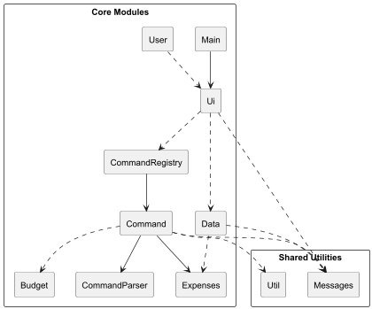
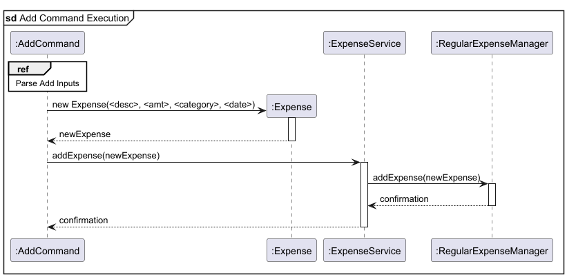
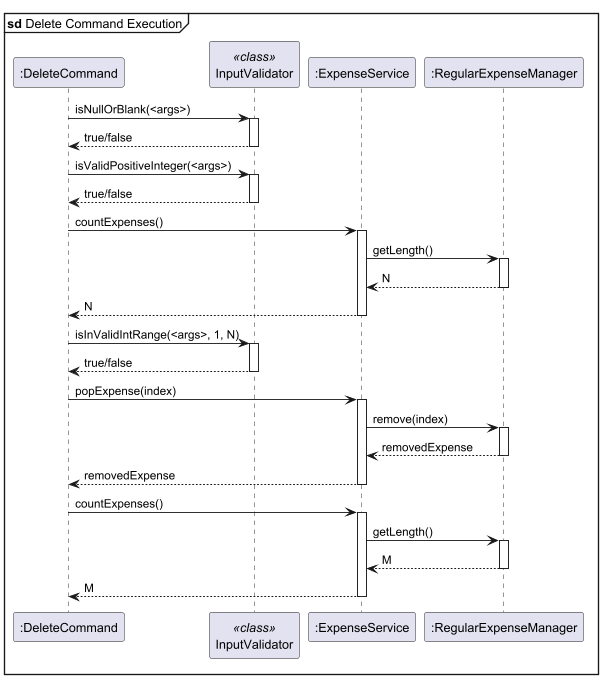
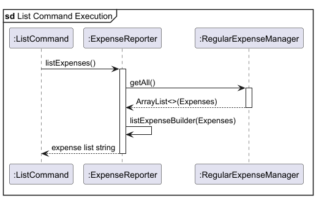
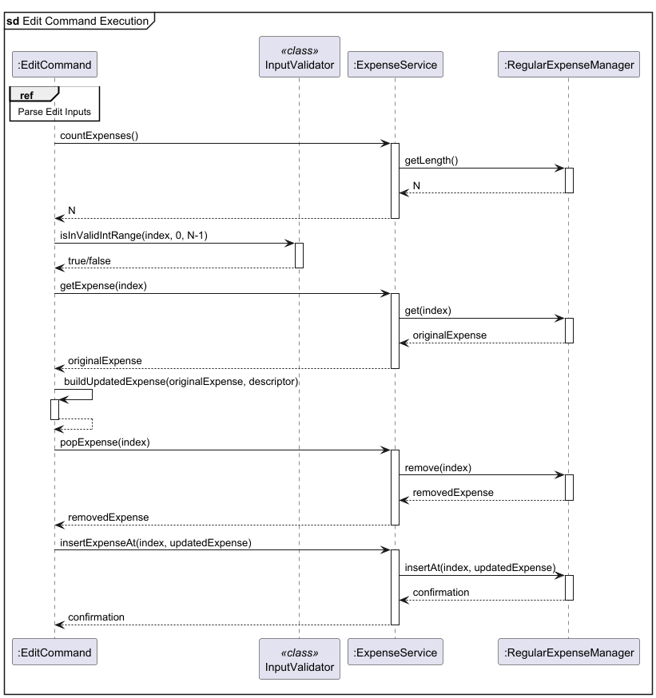
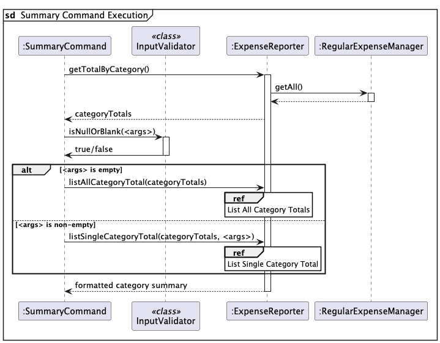
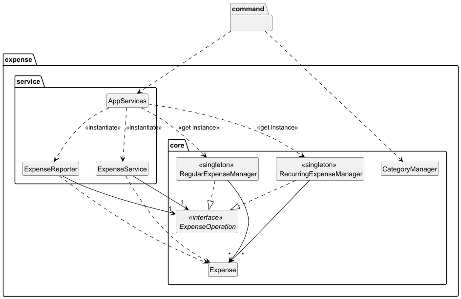

# Developer Guide

## Acknowledgements

{list here sources of all reused/adapted ideas, code, documentation, and third-party libraries -- include links to the original source as well}

## Design & implementation

FinTrek is a desktop app designed for university students to manage their expenses, optimized for use via the Command Line Interface (CLI).

## Architecture Overview

This diagram presents a high-level overview of the core components
that make up the FinTrek system. It illustrates how input flows
from the user to command execution, expense management, and data
persistence, with shared utilities supporting all layers.

-------------------
Core Module Roles
-------------------

[User]
- Represents the user providing input through the CLI interface.

[Main]
- The entry point of the application.
- Initializes services and launches the UI.

[Ui]
- Interfaces directly with the user.
- Accepts user input and forwards it to the command system.
- Displays output and error messages to the user.

[CommandRegistry]
- Maintains a registry of all supported commands.
- Responsible for resolving input commands to actual Command objects.

[Command]
- Represents the logic behind each user command (e.g., add, edit, list).
- Interacts with budget, expense data and performs operations.

[CommandParser]
- Parses structured arguments (e.g., /edit 2 /d lunch /$ 10).
- Used by commands that require detailed or optional arguments.

[Expenses]
- Manages both regular and recurring expenses.
- Handles all expense-related logic and state.

[Data]
- Responsible for loading and saving expense and budget data.
- Interacts with the file system for persistence.

[Util]
- Provides shared utility functions like input validation and date handling.
- Used across multiple modules for consistency and reuse.

[Messages]
- Central repository of user-facing messages and formatting templates.
- Ensures consistent messaging across the UI and command responses.

-------------------------
High-Level Flow Summary
-------------------------

1. [Main] launches the application and starts [Ui].
2. [Ui] receives input from [User] and routes it to [CommandRegistry].
3. [CommandRegistry] locates the correct [Command] to execute.
4. If needed, [Command] invokes [CommandParser] to extract arguments.
5. [Command] operates on [Expenses] to modify data.
6. [Expenses] interacts with [Data] to persist changes.
7. Throughout the process, [Util] and [Messages] support validation
   and formatting for consistent behavior and output.

-------------------
Design Principles
-------------------

- Modular and loosely coupled design.
- Commands are pluggable and easy to extend.
- Shared utilities reduce duplication and improve maintainability.
- Centralized message system ensures consistency in user output.

# Design & Implementation
## Ui + Command Registry
Here’s a (partial) class diagram of the Ui + Command Registry component
 
NOT YET IMPLEMENTED

The sequence diagram below illustrates the interactions of Ui and the Command Registry component

### Example Flow

## Command
CLASS DIAGRAM

---
> ### ℹ️ Notes about differences for regular and recurring expense
>- The main format difference between these two types is the additional `-recurring` for calling recurring expense functions.
>- In addition, each type has their own manager class: `RegularExpenseManager` and `RecurringExpenseManager` are for regular and recurring expenses respectively.
All the sequential diagrams below will use `RegularExpenseManager` for regular expenses to ensure consistency.
---

### Adding Expenses
The `/add` command enables users to add an expense into the list of expenses.

#### Step-by-Step Execution Flow
1. `AddCommand` receives the user's argument, which is in the form `<DESCRIPTION> $<AMOUNT> [/c <CATEGORY>] [/dt <DATE>]`.
2. Through a complicated process there by abstracted out as a reference frame, the user's
argument is then parsed to obtain the following parameters:

- `<desc>`: The expense description, limited to 100 characters
- `<amt>`: The expense amount, a positive number no higher than `1 000 000 000` (one billion)
- `[<category>]` The expense category, limited to 100 characters, and set by default to `UNCATEGORIZED` if left empty
- `[<date>]` The date for the expense of the format `dd-MM-yyyy`, which is set by default to today's date
if left empty

3. `AddCommand` then creates a new `Expense` object called `newExpense`,  by instantiating `new Expense(<desc>, <amt>, <category>, <date>)` which 
is the constructor for the `Expense` object. 

4. `AddCommand` then proceeds to add this new expense into the list:

- It calls `addExpense(newExpense)` on `ExpenseService`.
- This internally invokes `addExpense(newExpense)` on `RegularExpenseManager`
- `RegularExpenseManager` then adds `newExpense` into the current list of expenses, and the confirmation is
subsequently returned to `AddCommand`
### Delete Expenses

The `/delete` command enables users to remove an expense from the expense list by specifying its index.

#### Step-by-Step Execution Flow

1. DeleteCommand receives the user's argument (e.g., an index to delete).

2. The command first checks for invalid or missing input:
  - Calls InputValidator.isNullOrBlank(args)
  - If the input is blank or null, an error is returned.

3. It then checks whether the input is a valid positive integer:
  - Calls InputValidator.isValidPositiveInteger(args)
  - This ensures the input is a proper index number.

4. The command calls countExpenses() to determine the total number (N)
   of current expenses:
  - This invokes ExpenseService.getLength()
  - Which forwards to RegularExpenseManager.getLength()

5. To ensure the index is within range:
  - It calls InputValidator.isInValidIntRange(args, 1, N)

6. If the index is valid, the command proceeds to delete:
  - It calls popExpense(index) on ExpenseService
  - This internally calls remove(index) on RegularExpenseManager
  - The removed Expense object is returned to the command

7. After deletion, the command may call countExpenses() again:
  - This allows it to report the new size (M) of the expense list
  - The new count is retrieved in the same way via getLength()
### List Expenses
The `/list` command lists down the current list of expenses, according to the order the expenses
have been added.

#### Step-by-Step Execution Flow
1. The user launches the application and adds some expenses into the application.
2. The user executes `/list` to view their current list of expenses.
3. `ListCommand` then proceeds to obtain the `String` equivalent of the current list
of expenses:

- It calls `listExpenses()` on `ExpenseReporter`
- This internally invokes `getAll()` on `RegularExpenseManager`, to which 
`RegularExpenseManager` would return `ArrayList<>(Expenses)`, the current list of 
expenses in the form of an `ArrayList<>` object.
- `ExpenseReporter` executes `listExpenseBuilder(Expenses)` to obtain
the `String` equivalent of the list of expenses from `Expenses`, an `ArrayList<>` object.
- The list of expenses in the form of a `String` is then returned to `ListCommand`

4. `ListCommand` displays the current list of expenses along with a successful command message.

### Edit Expenses

The `/edit` command allows us the user modify `DESCRIPTION`, `AMOUNT`, `CATEGORY` and `DATE` of a

#### Step-by-Step Execution Flow
1. The user launches the application and adds some expenses into the application.

2. The user executes `/edit 2 /$ 10` to edit a regular expense with `INDEX` 2 in the list and change its `AMOUNT` to `$10` now.
The `execute()` will call `parse(arguments)`to parse all the parameters needed to be edited.

3. The `INDEX` will be checked to see if it lies within the lower and upper bound.
The lower bound is set to 1, while the upper bound is done by calling `countExpenses()`, on `ExpenseService`, - 1 since the indexes start from zero.

4. Upon validation of the index, it will call `getExpense(index)` on `ExpenseService` to get an `Expense` object: `original` to be modified.

5. An `Expense` object called `updated` will be compared with the `original` with the parameter needed to be changed. 

6. Next, it will call `popExpense(index)` to remove `original` from the list and then `insertExpense(index, updated)` to insert the updated expense at the same `index`.

7. Finally, it will return a confirmation by returning `new CommandResult(true, message)` in which `message` is the successful message after updating the expense.
This signifies the end and successful process of `/edit`.

### Summary of Expenses

The `/summary` command prints out the total amount spent for each category from the list of regular expenses. 
It also prints out the `HIGHEST SPENDING` category with the associated amount along with the `GRAND TOTAL` of the regular expenses.

#### Step-by-Step Execution Flow
1. The user launches the application and adds some expenses into the application.

2. The user executes `/summary food` to view expenses for a specific category `food`.
The `execute()` method identifies the category parameter and calls `ExpenseReporter#listSingleCategoryTotal("food")`.

3. The `ExpenseReporter` filters the expenses to show only those in the category `food`,
returning a formatted summary of the category `food`.

4. If the specified category does not exist, `execute()` returns an error message.

5. Alternatively, the user executes `/summary` command to view the overall summary of the current expenses.
The `/summary` command calls `ExpenseReporter#listAllCategoryTotals()`.

6. The `ExpenseReporter` processes the expense data and returns a formatted summary containing category totals,
the highest spending category, and the grand total.

## Expense

### High-Level Responsibilities & Flow

1. [Command]
  - Represents an abstract base for all user commands.
  - Each command (e.g., AddCommand, EditCommand) interacts with
    expense-related logic via the service layer.

2. [AppServices]
  - A central factory that provides pre-instantiated shared services.
  - Holds singleton instances of:
    - ExpenseService (for data manipulation)
    - ExpenseReporter (for analytics and summaries)
  - It decouples command logic from low-level object creation.

3. [ExpenseService]
  - Provides a unified API to manipulate expenses.
  - Delegates actual data operations to the appropriate expense manager
    (either regular or recurring).

4. [ExpenseReporter]
  - Offers read-only views over expense data.
  - Used for listing, calculating totals, category summaries, etc.

5. [RecurringExpenseManager] and [RegularExpenseManager]
  - Singleton classes that manage recurring and regular expenses respectively.
  - Internally maintain a list of Expense objects.
  - Both implement the shared [ExpenseOperation] interface.

6. [ExpenseOperation] (Interface)
  - Abstracts core methods like `add`, `remove`, `get`, and `clear`.
  - Allows service and reporter classes to be reused across both
    recurring and regular modes.

7. [Expense]
  - The base model class representing a single financial transaction.
  - Stores fields like description, amount, category, and date.

### Example Flow

When a user runs a command like `/add`:

1. The AddCommand class (a subclass of Command) is executed.
2. Through AppServices, it obtains the correct ExpenseService instance.
3. ExpenseService adds the new Expense to either the
   RegularExpenseManager or RecurringExpenseManager.
4. If the user runs a query command like `/summary`,
   the command calls ExpenseReporter to aggregate data.

## Logging

`Logger.log` was used throughout the code to help the process of debugging and ensuring developers what commands or classes are called in the process.
This is set to `Level.FINE` to ensure the logs are not printed out when running the product.

## Input handling

All user inputs will be forced to be lowercase to be compared with the HashMap for the functions created for general and recurring expenses.

## Product scope
### Target user profile

University Students

We would like to help students to manage their money wisely through creating a financial chatbot: FinTrek.
Hopefully, students will be more financially conscious and able to manage their budget wisely. 

### Value proposition

1. Provide easy access to track and record expenses
2. Reduce the hassle of manually calculating expenses 
3. Generate summaries and trends for user spending
4. Provide financial awareness to users
5. Simplify the process of splitting expenses amongst friends 
6. Helpful for students to manage their budget
7. More secure and portable than physical records

## User Stories

| Version | As a ...           | I want to ...                                                                         | So that I can ...                                                  |
|---------|--------------------|---------------------------------------------------------------------------------------|--------------------------------------------------------------------|
| v1.0    | new user           | ask the bot for a guide on the commands                                               | know how to use the application                                    |
| v1.0    | student            | add an expense into the list of expenses                                              | keep track of my expenses                                          |
| v1.0    | student            | delete an expense from the list of expenses                                           | remove something I wrongly listed                                  |
| v1.0    | lazy student       | automatically calculate statistics pertaining to my expenses                          | save a lot of time by not counting manually                        |
| v2.0    | student            | edit the details of an expense from the current list of expenses                      | have more flexibility to edit details in case I enter them wrongly |
| v2.0    | analytical student | get a summary of the total spending for each category                                 | know where most of my monthly budget goes to                       |
| v2.0    | lazy student       | set up recurring spending or expenses                                                 | save time by not adding them manually every month                  |
| v2.0    | meticulous student | sort my list of expenses based on dates, categories, or amount                        | better organize my list of expenses                                |
| v2.0    | forgetful student  | set up a budget limit or receive warnings when I will almost exceed my monthly budget | save money by not accidentally overspending                        |
| v2.0    | typical user       | save my list of expenses into a save file                                             | easily load them whenever I enter the application                  |
    

## Non-Functional Requirements

### 1. Usability

- The FinTrek app should be easy and intuitive to use through a Command Line Interface (CLI) -- no Graphical User Interface (GUI) required.
- Users should be able to learn the basic commands within 5 minutes with assistance from the `/help`
command or the User Guide.
- A user with above average typing speed for regular English text (i.e. not code) should be able to accomplish most of the tasks faster using commands than using the mouse.

### 2. Performance

- Commands should be processed within 1 second under normal usage (under 1000 expenses)
- The system should support up to 1000 expense entries without noticeable lag.

### 3. Portability

- The application should run on any mainstream OS with Java 17 installed (Windows, macOS, Linux, etc).
- No installation should be required other than compiling and running the `.jar` file via a Java-compatible terminal.

### 4. Data Persistence

- All expense and budget data persists between local runs of the application as they saved to a local save file (`data.txt`).
- Saving should occur automatically after each command (`/add`, `/delete`, `/edit`, etc).

### 5. Logging

- All command executions, system errors, and critical warnings should be logged using Java's `Logger` to help with debugging and audits.

## Glossary

* *glossary item* - Definition

## Instructions for manual testing

### CommandRouter

**Purpose**: To verify that user input is correctly interpreted and dispatched to the appropriate command.

##### Correct behavior

1. Launch the app using `FinTrek.main()`.
2. Type the following commands one at a time:

- `/add lunch $10 /c food`  
  → Expected: Expense is added with category `food`. Success message is printed.

- `/list`  
  → Expected: Displays a list containing the added expense.

- `/delete 1`  
  → Expected: Deletes the first expense. Success message with updated count is printed.

- `/total`  
  → Expected: Displays the total amount of all current expenses.

- `/average`  
  → Expected: Displays the average amount of all current expenses.

- `/help add`  
  → Expected: Displays detailed help message for the `/add` command.

- `/add-reccuring mobile plan $20 /c necessity`
  → Expected: The expense will be added to the recurring list. This recurring expense will be added once the app restarted.

- `/add-recurring installment $10 /c phone 01-01-2025`
  → Expected: The expense will be added to the recurring list and will be added montly to the regular expense list on the first day of every month.

##### Invalid command formats

Type the following commands one at a time:

- `add lunch $10`  
  → Expected: Error message — must start with '/'.

- `/blah blah`  
  → Expected: Error message — invalid command.

- *(Empty input or whitespace only)*  
  → Expected: Error message — must enter a command starting with '/'.

- `/add mobile plan $20 1-1-2025`  
  → Expected: Error message — key in '/help add' for more information

**Note:** All errors and successful command parsing are logged using the Java `Logger`.
