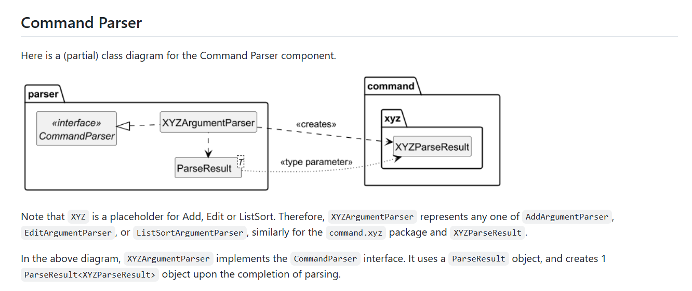
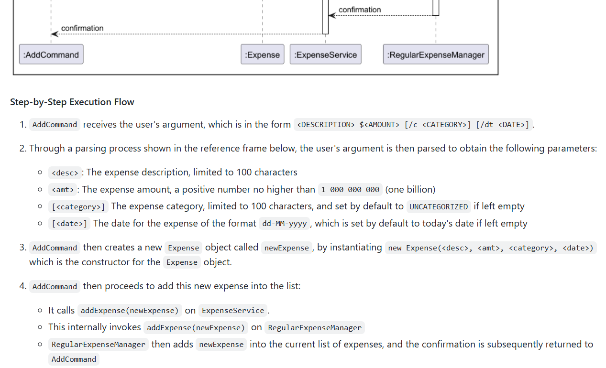
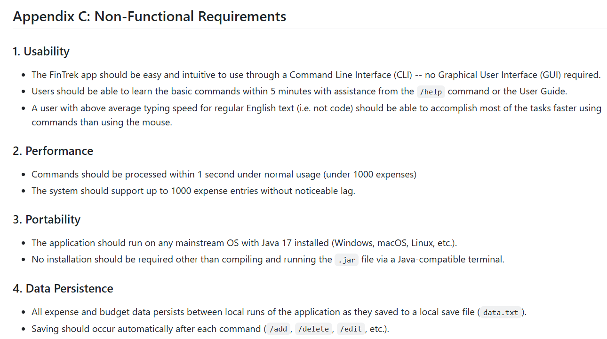
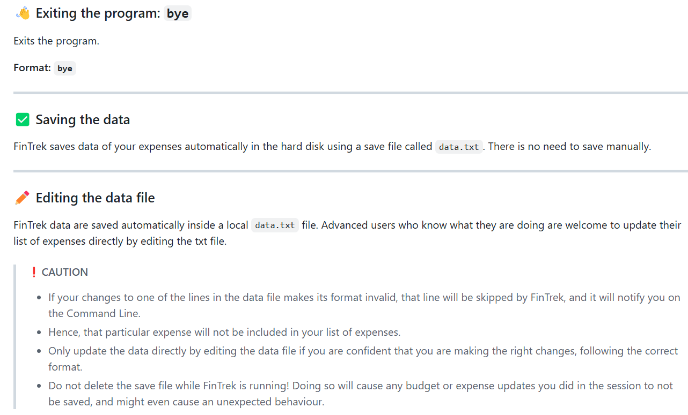
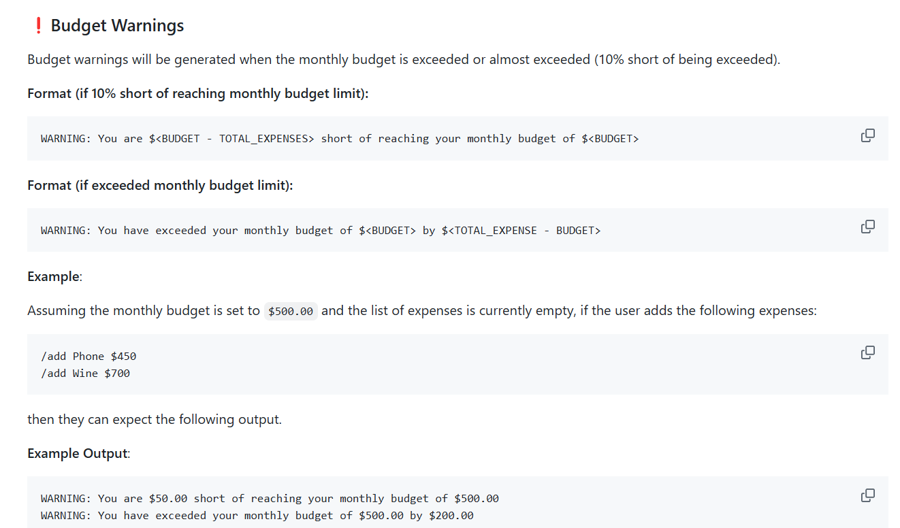

# Edward Rafael Lukito - Project Portfolio Page

## Acknowledgements
I would like to acknowledge and give credits to:
1. My team `F12-1`, for being very cooperative and easy to work with during the course of the tP.
2. My tutor, Lee Jun Hao Bryan, who was always very friendly and did not hesitate to provide guidance whenever needed.
3. The SE-EDU organization for their resources. Their resources are the inspiration of our User Guide, Developer Guide, and also my
Project Portfolio Page.

## Overview
**FinTrek** is a simple and intuitive Command Line Interface (CLI) tool
that helps users track their personal expenses. Users can quickly add, view,
analyze, and manage their expenses using short commands.
It is designed for speed, simplicity, and ease of use. It is written in Java, and has about
`10000` lines of code. Given below are my contributions to the project.

### Summary of Contributions
* Code contributed:
  [RepoSense Link](https://nus-cs2113-ay2425s2.github.io/tp-dashboard/?search=&sort=groupTitle&sortWithin=title&timeframe=commit&mergegroup=&groupSelect=groupByRepos&breakdown=true&checkedFileTypes=docs~functional-code~test-code~other&since=2025-02-21&tabOpen=true&tabType=authorship&tabAuthor=edwardrl101&tabRepo=AY2425S2-CS2113-F12-1%2Ftp%5Bmaster%5D&authorshipIsMergeGroup=false&authorshipFileTypes=docs~functional-code~test-code~other&authorshipIsBinaryFileTypeChecked=false&authorshipIsIgnoredFilesChecked=false)

#### Enhancements Implemented

* New Feature: Added the ability to calculate average expenses.
    * Highlights: This function is straightforward to implement, but I also added a maximum limit with this function
  to prevent any errors with large numbers.

* New Feature: Enabled saving and loading of monthly budgets, recurring expenses, and regular expenses upon startup.
    * What it does: If the user has existing monthly budgets, recurring expenses or regular expenses, then FinTrek
  loads the data upon startup and displays it to the user.
    * Justification: This feature is crucial for long-time users as this gives them the ease of not repeatedly
  inputting whatever data they had in the last session.
    * Highlights: The implementation of this feature was challenging. It involved writing to the save file in a certain format
  and required an additional file data parser to properly parse the data read from the save file with regex patterns that are hard to deal
  with. This enhancement, however, was very
  rewarding for the app as it gave the app data persistence.
    * Credits: I used ideas from my own iP and from some of my teammates' iP on how to save and write to local save files.

* New Feature: Added the functionality to set monthly budgets and receive budget warnings when the budget is 
exceeded or is 10% short of being exceeded.
    * What it does: The user is able to set monthly budgets. FinTrek then displays warning messages to the user if their total
  expenditure for this month exceeds the monthly budget or is 10% short from doing so.
    * Justification: This feature is beneficial for users who wish to improve their budgeting plan,
  but end up losing track of their total expense for the month.
    * Highlights: This feature alone was not hard to implement, but the process was interesting since I had
  to integrate it with the `add` command, hence integration testing was done thereafter. I also added a maximum limit
  for this command to prevent errors with large numbers.

*  Enhancements to Existing Features: Enabled the adding of dates when adding expenses.

* JUnit Tests:
  * Wrote JUnit tests for the `/average`, `/total`, `/add`, `/budget`, `/list-sort` commands and the `Expense`, `FileDataParser` classes ([Link to Test Code](https://nus-cs2113-ay2425s2.github.io/tp-dashboard/?search=&sort=groupTitle&sortWithin=title&timeframe=commit&mergegroup=&groupSelect=groupByRepos&breakdown=true&checkedFileTypes=docs~functional-code~test-code~other&since=2025-02-21&tabOpen=true&tabType=authorship&tabAuthor=edwardrl101&tabRepo=AY2425S2-CS2113-F12-1%2Ftp%5Bmaster%5D&authorshipIsMergeGroup=false&authorshipFileTypes=test-code&authorshipIsBinaryFileTypeChecked=false&authorshipIsIgnoredFilesChecked=false))

* Other Enhancements:
    * Extensively added JavaDoc comments to non-trivial methods.
    * Refactored code to maintain coding standards, readability, and obey the SRP whenever necessary.

#### Documentation

* Code contributed towards documentation: [Link to Docs Code](https://nus-cs2113-ay2425s2.github.io/tp-dashboard/?search=&sort=groupTitle&sortWithin=title&timeframe=commit&mergegroup=&groupSelect=groupByRepos&breakdown=true&checkedFileTypes=docs~functional-code~test-code~other&since=2025-02-21&tabOpen=true&tabType=authorship&tabAuthor=edwardrl101&tabRepo=AY2425S2-CS2113-F12-1%2Ftp%5Bmaster%5D&authorshipIsMergeGroup=false&authorshipFileTypes=docs&authorshipIsBinaryFileTypeChecked=false&authorshipIsIgnoredFilesChecked=false)

* Contributions to the User Guide:
  * Added important notes about the command format and a quick start guide.
  * Added and updated descriptions for the `/summary`, `/add`, `bye`, and `/budget` commands.
  * Updated the command summary to include the latest list of commands
    as well as their format
  * Listed out important cautionary information  regarding the saving and loading
    of data for FinTrek, and what not to do with the save file.
  * Extensively added  examples to almost all of the features.
  * Answered the FAQ section.
  * Added extra clarification on commands that allow extraneous parameters.

* Contributions to the Developer Guide:
  * Added `User Stories` section.
  * Added `Non-Functional Requirements (NFRs)` section.
  * Added table of contents.
  * Wrote out the step-by-step execution flows for the `/add`, `/list`, `/average`, and `/help` commands.
  * Drew out UML sequence diagrams for the `/average` and `/help` commands.
  * Drew out UML class diagram for the Command Parser component and explained
    its implementation.

#### Team

* Contributions to team-based tasks:
    * Updated the `gradle.yml` file to validate gradle wrapper, fixing the issue with the CI failing (PR [#39](https://github.com/AY2425S2-CS2113-F12-1/tp/pull/39))
    * Implemented code enhancements and refactoring whenever necessary.
    * Maintained the issue tracker (Issues [#115](https://github.com/AY2425S2-CS2113-F12-1/tp/issues/115), [#116](https://github.com/AY2425S2-CS2113-F12-1/tp/issues/116), [#117](https://github.com/AY2425S2-CS2113-F12-1/tp/issues/116
  ), [#118](https://github.com/AY2425S2-CS2113-F12-1/tp/issues/116), [#209](https://github.com/AY2425S2-CS2113-F12-1/tp/issues/209), [#210](https://github.com/AY2425S2-CS2113-F12-1/tp/issues/210), and more)
    * Updated user/developer docs that are not specific to features (NFRs, Quick Start Guide, FAQ, User Stories)
    * Maintained the CI pipeline by fixing checkstyle errors.

* Review contributions:
    * Made 28 comments on others' PRs as of March 31 ([CS2113 tP Comments Dashboard](https://nus-cs2113-ay2425s2.github.io/dashboards/contents/tp-comments.html)) and likely
  to have made about 40 by now.
    * Reviewed PRs and gave non-trivial comments (PRs [#19](https://github.com/AY2425S2-CS2113-F12-1/tp/pull/19#discussion_r1997640278),
  [#24](https://github.com/AY2425S2-CS2113-F12-1/tp/pull/24#discussion_r1995777073),
  [#31](https://github.com/AY2425S2-CS2113-F12-1/tp/pull/31#discussion_r1997669041),
  [#173](https://github.com/AY2425S2-CS2113-F12-1/tp/pull/173))

#### Community

* Contributions beyond the project team:
    * Went the extra mile to deliver beyond the minimum of 5 review comments (19 comments) for others' iP ([CS2113 iP Comments Dashboard](https://nus-cs2113-ay2425s2.github.io/dashboards/contents/ip-comments.html))
    * Reviewed the Developer Guide of another team and gave suggestions on what could be done better.

#### Contributions to the Developer Guide (Extracts)

Below are some extracts of my work as part of our Developer Guide.

I drew out the UML class diagram for the Command Parser component as shown below.

As another example of my work, below is also one of my explanations for the
step-by-step execution flow of a command, namely the `/add` command.

Finally, I also added documentation on things not specific to features, such as the
Non-Functional Requirements (NFRs) shown below.

#### Contributions to the User Guide (Extracts)
Below are some extracts of my work as part of our User Guide.

I wrote out important information regarding data persistence in the User Guide, as shown below.

I also explained some features such as budget warnings and gave the user
example outputs so they could understand better.

